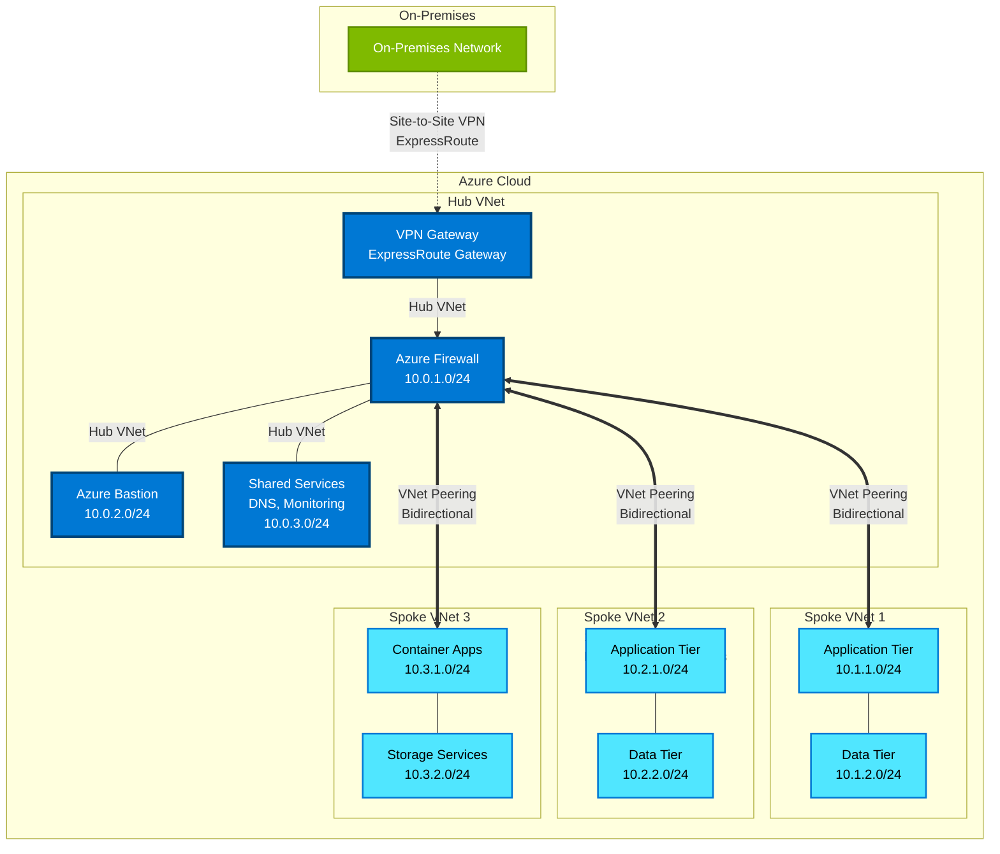

# Azure Hub and Spoke Architecture with VNet Peering

This diagram illustrates the Azure hub and spoke network topology using VNet peering, which is a recommended pattern from the Azure Well-Architected Framework for enterprise-scale networking.

## Architecture Overview

## Key Components

### Hub VNet (10.0.0.0/16)
- **VPN Gateway / ExpressRoute Gateway**: Provides hybrid connectivity to on-premises networks
- **Azure Firewall**: Centralized network security and traffic filtering
- **Azure Bastion**: Secure RDP/SSH connectivity without public IP exposure
- **Shared Services**: DNS, monitoring, and other centralized services

### Spoke VNets
- **Spoke 1 (10.1.0.0/16)**: Production workloads with isolated application and data tiers
- **Spoke 2 (10.2.0.0/16)**: Development/testing environment
- **Spoke 3 (10.3.0.0/16)**: Shared application services (containers, storage)

### VNet Peering
- **Bidirectional peering** between hub and each spoke
- Low latency, high bandwidth connectivity
- Traffic between spokes can be routed through hub firewall for security
- No gateway transit required for spoke-to-spoke communication through hub

## Architecture Benefits

### Security
- **Centralized security controls**: All traffic can be inspected by Azure Firewall
- **Network isolation**: Spokes are isolated from each other by default
- **Secure hybrid connectivity**: Controlled access to on-premises resources
- **Zero Trust**: Azure Bastion eliminates the need for public IPs on VMs

### Reliability
- **High availability**: VNet peering is highly available by design
- **No single point of failure**: Multiple paths for redundancy
- **Regional resiliency**: Can extend to multi-region hub-spoke topologies

### Performance Efficiency
- **Low latency**: VNet peering provides direct network path
- **High throughput**: No bandwidth bottlenecks from appliances
- **Scalability**: Easy to add new spoke VNets as needed

### Cost Optimization
- **Shared resources**: Hub services are shared across all spokes
- **Efficient routing**: Direct peering reduces data transfer costs
- **Pay per use**: Only pay for active VNet peering connections

### Operational Excellence
- **Simplified management**: Centralized governance in hub
- **Clear separation**: Workloads isolated in dedicated spokes
- **Flexible expansion**: Add spokes without impacting existing workloads

## Implementation Considerations

1. **Route Tables**: Configure User Defined Routes (UDRs) to force traffic through Azure Firewall
2. **Network Security Groups (NSGs)**: Apply granular security rules at subnet level
3. **Service Endpoints**: Enable for Azure PaaS services to avoid internet routing
4. **Private Endpoints**: Use for private connectivity to PaaS services
5. **DNS**: Configure custom DNS in hub for name resolution across all VNets
6. **Monitoring**: Implement Azure Monitor, Network Watcher, and NSG Flow Logs

## Reference Architecture

This diagram is based on:
- [Azure Hub-Spoke Network Topology](https://learn.microsoft.com/azure/architecture/reference-architectures/hybrid-networking/hub-spoke)
- [Azure Well-Architected Framework - Networking](https://learn.microsoft.com/azure/well-architected/networking/)
- [VNet Peering Best Practices](https://learn.microsoft.com/azure/virtual-network/virtual-network-peering-overview)
