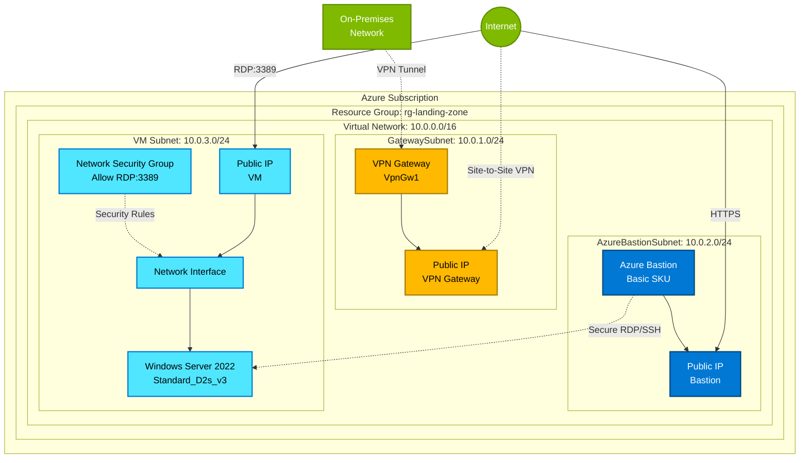

# Azure Landing Zone Architecture

This document describes the architecture of the Azure Landing Zone deployed by this Terraform configuration.

## Architecture Diagram

## Components

### 1. Virtual Network (10.0.0.0/16)
- **Purpose**: Isolated network environment for all resources
- **Address Space**: 10.0.0.0/16 (65,536 IP addresses)
- **Subnets**: 3 subnets for different purposes

### 2. GatewaySubnet (10.0.1.0/24)
- **Purpose**: Dedicated subnet for VPN Gateway
- **Size**: /24 (254 usable IP addresses)
- **Resources**:
  - VPN Gateway (VpnGw1 SKU)
  - Public IP address for VPN connectivity

### 3. AzureBastionSubnet (10.0.2.0/24)
- **Purpose**: Dedicated subnet for Azure Bastion
- **Size**: /24 (254 usable IP addresses)
- **Resources**:
  - Azure Bastion (Basic SKU)
  - Public IP address for Bastion access

### 4. VM Subnet (10.0.3.0/24)
- **Purpose**: Hosts virtual machines
- **Size**: /24 (254 usable IP addresses)
- **Resources**:
  - Windows Server 2022 Virtual Machine
  - Network Interface Card
  - Public IP address (for direct RDP)
  - Network Security Group

## Network Flow

### Option 1: Direct RDP Access
1. User connects from Internet to VM Public IP
2. NSG allows RDP traffic on port 3389
3. Traffic reaches VM through Network Interface
4. User authenticates with admin credentials

### Option 2: Bastion Access (Recommended)
1. User accesses Azure Portal
2. Navigates to VM and selects "Connect via Bastion"
3. Traffic flows through Bastion Public IP (HTTPS only)
4. Bastion establishes secure RDP session to VM private IP
5. User authenticates with admin credentials
6. Session runs in browser (no RDP client needed)

### Option 3: VPN Gateway
1. On-premises network establishes VPN connection
2. Site-to-Site VPN tunnel created
3. On-premises users access Azure resources via private IPs
4. Traffic encrypted over Internet

## Security Considerations

### Network Security Group (NSG)
- **Inbound Rule**: Allows RDP (TCP 3389) from specified source
- **Default**: Currently allows from `*` (all sources) - **Change for production!**
- **Recommendation**: Restrict to specific IP addresses or ranges

### Azure Bastion Benefits
- No public IP exposure required for VMs (when used exclusively)
- SSL/TLS over port 443 to Azure Portal
- Protection against port scanning
- Hardened platform managed by Microsoft
- No need to manage NSG rules for RDP/SSH

### VPN Gateway Security
- Encrypted VPN tunnels
- Support for IKEv2, OpenVPN, and SSTP
- Can integrate with on-premises firewalls
- Supports Azure Active Directory authentication

## High Availability Considerations

### Current Configuration
- Single VM (no redundancy)
- Single VPN Gateway (active-passive)
- Basic Bastion SKU

### Production Recommendations
1. **Virtual Machines**: 
   - Deploy VMs across Availability Zones
   - Use Availability Sets or Virtual Machine Scale Sets
   - Implement load balancing

2. **VPN Gateway**:
   - Consider active-active configuration
   - Use VpnGw2AZ or VpnGw3AZ SKUs for zone redundancy

3. **Azure Bastion**:
   - Upgrade to Standard SKU for scaling
   - Consider zone-redundant deployment

## Cost Optimization

### Current Monthly Costs (Approximate, East US)
| Resource | SKU/Size | Monthly Cost |
|----------|----------|--------------|
| VPN Gateway | VpnGw1 | ~$140 |
| Azure Bastion | Basic | ~$140 |
| Windows VM | Standard_D2s_v3 | ~$120 |
| Public IPs (3) | Standard | ~$11 |
| **Total** | | **~$411** |

### Cost Saving Options
1. **VPN Gateway**: Use if hybrid connectivity is required; otherwise, remove
2. **Azure Bastion**: Can be removed if using direct RDP (less secure)
3. **VM Size**: Adjust based on workload requirements
4. **Public IPs**: Reduce number by using only Bastion for access

## Deployment Time

- **Virtual Network**: < 1 minute
- **Network Security Group**: < 1 minute
- **Public IPs**: < 1 minute
- **Virtual Machine**: 3-5 minutes
- **Azure Bastion**: 5-10 minutes
- **VPN Gateway**: 30-45 minutes ⚠️

**Total Deployment Time**: Approximately 45-60 minutes

> **Note**: VPN Gateway deployment is the longest-running operation. This is normal and expected.

## Next Steps

After deployment:

1. **Configure VPN Gateway**: Set up site-to-site or point-to-site connections
2. **Harden Security**: Restrict NSG rules to specific IP ranges
3. **Install Applications**: Deploy your workloads on the VM
4. **Set Up Monitoring**: Configure Azure Monitor and Log Analytics
5. **Implement Backup**: Enable Azure Backup for the VM
6. **Document**: Record credentials, configurations, and procedures

## References

- [Azure Virtual Network Documentation](https://docs.microsoft.com/azure/virtual-network/)
- [Azure VPN Gateway Documentation](https://docs.microsoft.com/azure/vpn-gateway/)
- [Azure Bastion Documentation](https://docs.microsoft.com/azure/bastion/)
- [Azure Virtual Machines Documentation](https://docs.microsoft.com/azure/virtual-machines/)
- [Azure Well-Architected Framework](https://docs.microsoft.com/azure/architecture/framework/)
